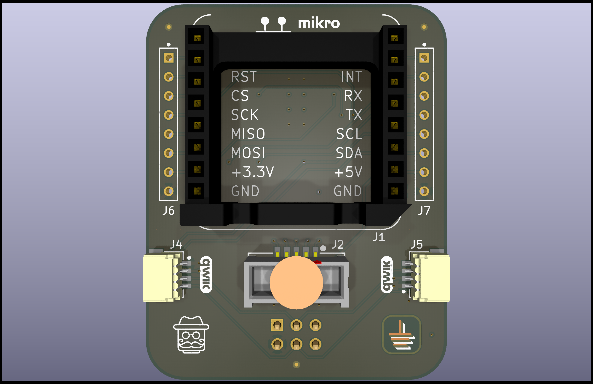
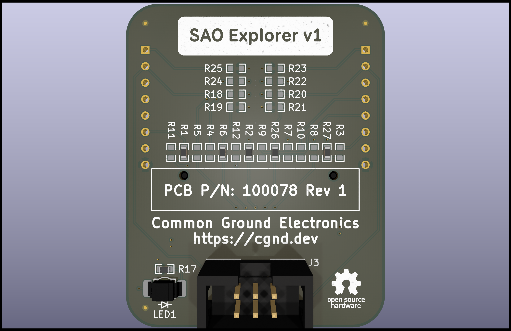

# SAO Explorer v1

The SAO Explorer v1 is a [Simple Add-on](https://hackaday.io/project/175182-simple-add-ons-sao) (SAO) board that breaks out the 2x3 0.100" (2.54mm) SAO v2 header into a [mikroBUS](https://www.mikroe.com/mikrobus) socket and a couple SparkFun [Qwiic](https://www.sparkfun.com/qwiic) connectors. This makes it really easy to connect hundreds of different I2C breakout boards to a SAO host board—like a [Supercon badge](https://hackaday.com/2023/10/18/2023-hackaday-supercon-badge-welcome-to-the-vectorscope/)!—by quickly plugging in [MikroE Click](https://www.mikroe.com/click?interface*=i2c,i2c), [SparkFun Qwiic](https://www.sparkfun.com/categories/399), or [Adafruit STEMMA QT](https://www.adafruit.com/category/620) boards. No soldering required!

It also has a 2x5 0.050" (1.27mm) socket that allows a [Binho Nova](https://binho.io/products/usb-host-adaptor?variant=14141584343095) Multi-Protocol USB Host Adapter to be used as an I2C controller (instead of a badge). The [Binho Mission Control Software](https://support.binho.io/getting-started/binho-mission-control/download-and-installation) provides an easy-to-use GUI interface for quickly testing out new I2C devices without having to write a single line of code.

Entry for the [Supercon 8 - Add On Contest](https://hackaday.io/contest/197237-supercon-8-add-on-contest): https://hackaday.io/project/198465-sao-explorer

## Pinout Decoder Ring

The I2C and GPIO1/2 pins on the SAO connector are directly connected to the I2C, INT, and RST pins on the mikroBUS socket.

By default, the Binho Nova is connected to the I2C, INT, RST, and PWM pins on the mikroBUS socket. However, by changing a couple jumper resistors on the back of the board, the Binho Nova can be connected to the UART or SPI pins on the mikroBUS socket instead.

| SAO Connector Pin | mikroBUS socket | Binho Nova Socket                                    |
| ----------------- | --------------- | ---------------------------------------------------- |
| I2C SCL           | I2C SCL         | IO2/SCL/POCI/MISO *(populate R2, depopulate R9)*     |
| I2C SDA           | I2C SDA         | IO0/SDA/CS0/INT0 *(populate R1, depopulate R5)*      |
| GPIO1             | INT             | IO1/DAC/CS1/INT1 *(populate R6, depopulate R4)*      |
| GPIO2             | RST             | IO3/RX/SCK *(populate R26, depopulate R7, R10)*      |
| (not connected)   | PWM             | IO4/TX/PICO/MOSI *(populate R27, depopulate R3, R8)* |
| (not connected)   | AN              | IO1/DAC/CS1/INT1 *(populate R4, depopulate R6)*      |
| (not connected)   | UART TX         | IO3/RX/SCK *(populate R7, depopulate R10, R26)*      |
| (not connected)   | UART RX         | IO4/TX/PICO/MOSI *(populate R8, depopulate R3, R27)* |
| (not connected)   | SPI SCK         | IO3/RX/SCK *(populate R10, depopulate R7, R26)*      |
| (not connected)   | SPI POCI (MISO) | IO2/SCL/POCI/MISO *(populate R9, depopulate R2)*     |
| (not connected)   | SPI PICO (MOSI) | IO4/TX/PICO/MOSI *(populate R3, depopulate R8, R27)* |
| (not connected)   | SPI CS          | IO0/SDA/CS0/INT0 *(populate R5, depopulate R1)*      |
